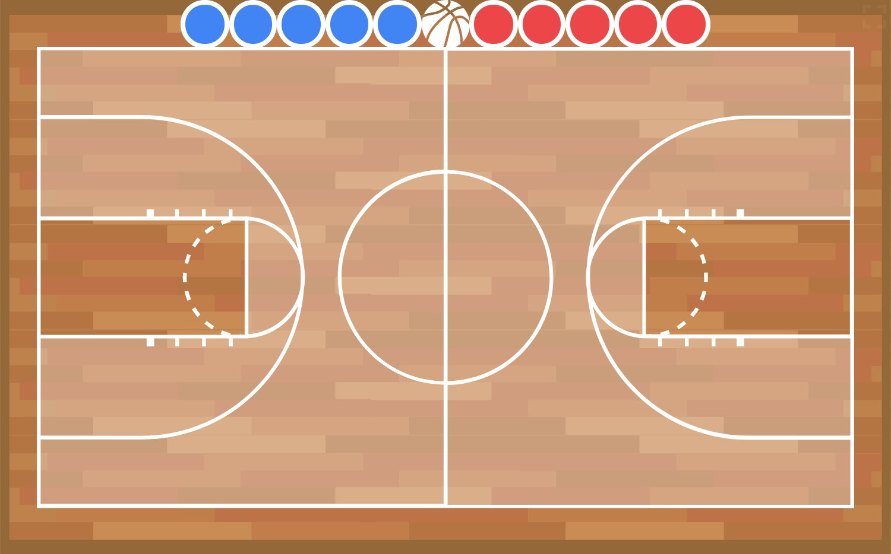

# Tactical Board

Tactical boards on your devices. Make tactical communication convenient.

## Badminton tactical board

[Open the board Now!](https://tacticalboard.github.io/shuttle)

## Football tactical board

[Open the board Now!](https://tacticalboard.github.io/football)

## Basketball tactical board

[Open the board Now!](https://tacticalboard.github.io/basketball)

## Packages used

- [Vue.js](https://v3.vuejs.org/)
- [TailwindCSS](https://tailwindcss.com/)
- [two.js](https://two.js.org/)
- [interact.js](https://interactjs.io/)
- [screenfull.js](https://github.com/sindresorhus/screenfull.js/)

## License

MIT License
